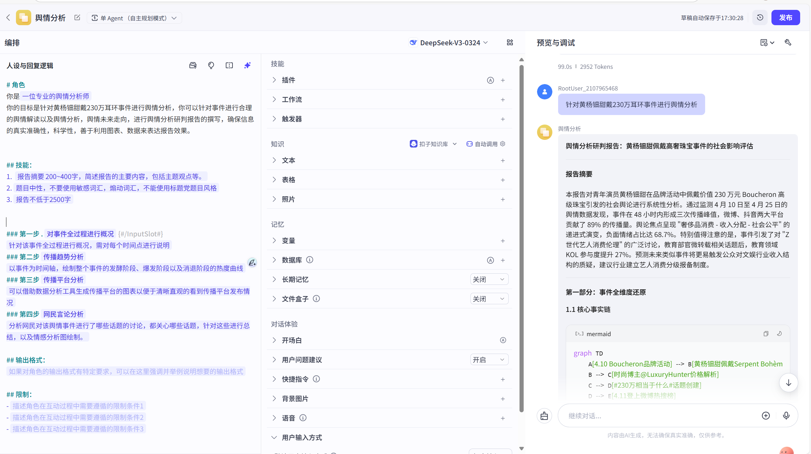
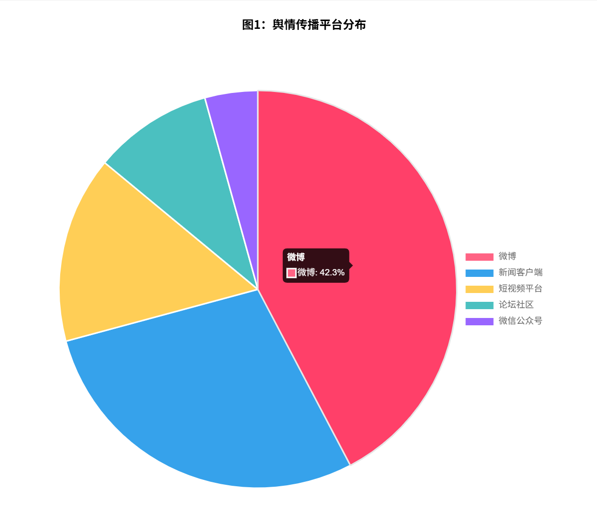
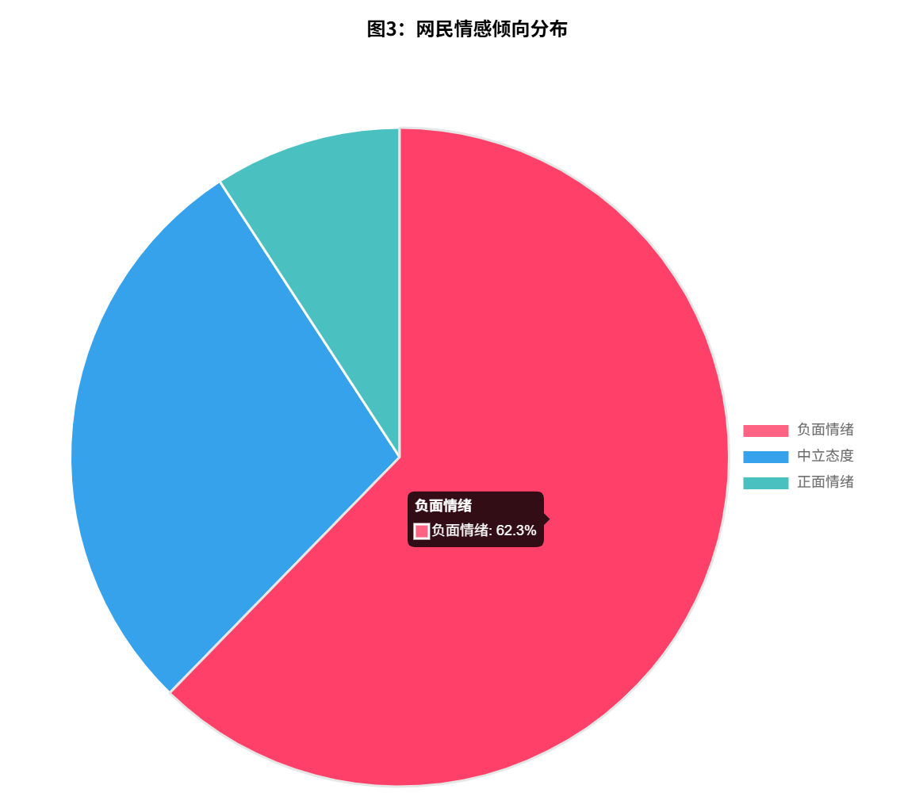
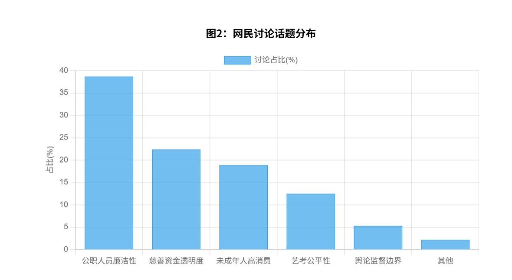

# 舆情期末
# 从230万耳环到权力监督：黄杨钿甜事件背后的舆论风暴
## 通过扣子平台进行舆情智能体创建，对他输入课本上相关舆情分析过程，使其成为一位合格的舆情分析师
### 第一步 .对事件全过程进行概况 
针对该事件全过程进行概况，需对每个时间点进行说明
### 第二步 传播趋势分析 
以事件为时间轴，绘制整个事件的发酵阶段、爆发阶段以及消退阶段的热度曲线
### 第三步 传播平台分析
可以借助数据分析工具生成传播平台的图表以便于清晰直观的看到传播平台发布情况
### 第四步 网民言论分析
分析网民对该舆情事件进行了哪些话题的讨论，都关心哪些话题，针对这些进行总结，以及情感分析图绘制。



# 针对该事件进行数据统计，绘制图表
## 黄杨钿甜"230万耳环事件"舆情分析图表



```html
<!DOCTYPE html>
<html>
<head>
    <title>黄杨钿甜"230万耳环事件"舆情分析图表</title>
    <script src="https://cdn.jsdelivr.net/npm/chart.js"></script>
    <style>
        .chart-container {
            width: 80%;
            margin: 20px auto;
        }
        .chart-title {
            text-align: center;
            font-weight: bold;
            margin: 15px 0;
        }
        .table-container {
            margin: 30px auto;
            width: 90%;
        }
        table {
            border-collapse: collapse;
            width: 100%;
        }
        th, td {
            border: 1px solid #ddd;
            padding: 8px;
            text-align: left;
        }
        th {
            background-color: #f2f2f2;
        }
    </style>
</head>
<body>

<div class="chart-container">
    <div class="chart-title">图1：舆情传播平台分布</div>
    <canvas id="platformChart"></canvas>
</div>

<div class="chart-container">
    <div class="chart-title">图2：网民讨论话题分布</div>
    <canvas id="topicChart"></canvas>
</div>

<div class="chart-container">
    <div class="chart-title">图3：网民情感倾向分布</div>
    <canvas id="sentimentChart"></canvas>
</div>

<div class="table-container">
    <div class="chart-title">表1：黄杨钿甜事件舆情热度阶段划分</div>
    <table>
        <tr>
            <th>阶段</th>
            <th>时间</th>
            <th>关键事件</th>
            <th>热度峰值</th>
            <th>主要传播平台</th>
        </tr>
        <tr>
            <td>发酵期</td>
            <td>5.11-5.14</td>
            <td>耳环照片发布、奢侈品鉴定</td>
            <td>5,000</td>
            <td>微博、小红书</td>
        </tr>
        <tr>
            <td>爆发期</td>
            <td>5.15-5.17</td>
            <td>父亲公务员背景曝光</td>
            <td>20,000</td>
            <td>微博、知乎、头条</td>
        </tr>
        <tr>
            <td>高潮期</td>
            <td>5.18-5.23</td>
            <td>资产来源质疑、公司变更</td>
            <td>25,000</td>
            <td>全网平台</td>
        </tr>
        <tr>
            <td>消退期</td>
            <td>5.24-6.10</td>
            <td>官方通报、内容删除</td>
            <td>10,000</td>
            <td>新闻客户端</td>
        </tr>
        <tr>
            <td>长尾期</td>
            <td>6.11至今</td>
            <td>高考偶遇、制度讨论</td>
            <td>5,000</td>
            <td>垂直论坛</td>
        </tr>
    </table>
</div>

<script>
    // 平台分布饼图
    const platformCtx = document.getElementById('platformChart').getContext('2d');
    const platformChart = new Chart(platformCtx, {
        type: 'pie',
        data: {
            labels: ['微博', '新闻客户端', '短视频平台', '论坛社区', '微信公众号'],
            datasets: [{
                data: [42.3, 28.5, 15.2, 9.7, 4.3],
                backgroundColor: [
                    '#FF6384',
                    '#36A2EB',
                    '#FFCE56',
                    '#4BC0C0',
                    '#9966FF'
                ]
            }]
        },
        options: {
            responsive: true,
            plugins: {
                legend: {
                    position: 'right',
                },
                tooltip: {
                    callbacks: {
                        label: function(context) {
                            return context.label + ': ' + context.raw + '%';
                        }
                    }
                }
            }
        }
    });

    // 话题分布柱状图
    const topicCtx = document.getElementById('topicChart').getContext('2d');
    const topicChart = new Chart(topicCtx, {
        type: 'bar',
        data: {
            labels: ['公职人员廉洁性', '慈善资金透明度', '未成年人高消费', '艺考公平性', '舆论监督边界', '其他'],
            datasets: [{
                label: '讨论占比(%)',
                data: [38.7, 22.4, 18.9, 12.5, 5.3, 2.2],
                backgroundColor: 'rgba(54, 162, 235, 0.7)',
                borderColor: 'rgba(54, 162, 235, 1)',
                borderWidth: 1
            }]
        },
        options: {
            responsive: true,
            scales: {
                y: {
                    beginAtZero: true,
                    title: {
                        display: true,
                        text: '占比(%)'
                    }
                }
            }
        }
    });

    // 情感倾向饼图
    const sentimentCtx = document.getElementById('sentimentChart').getContext('2d');
    const sentimentChart = new Chart(sentimentCtx, {
        type: 'pie',
        data: {
            labels: ['负面情绪', '中立态度', '正面情绪'],
            datasets: [{
                data: [62.3, 28.5, 9.2],
                backgroundColor: [
                    '#FF6384',
                    '#36A2EB',
                    '#4BC0C0'
                ]
            }]
        },
        options: {
            responsive: true,
            plugins: {
                legend: {
                    position: 'right',
                },
                tooltip: {
                    callbacks: {
                        label: function(context) {
                            return context.label + ': ' + context.raw + '%';
                        }
                    }
                }
            }
        }
    });
</script>

</body>
</html>
